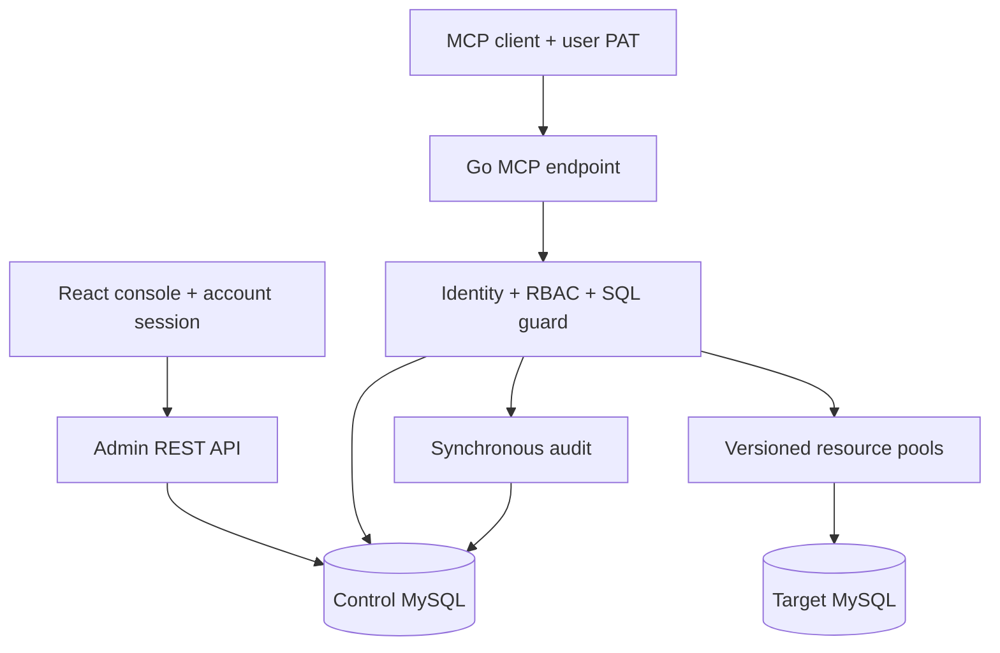

# 原仓库调研与落地决策

调研日期：2026-09-19。为使结论可复核，分析固定在以下提交，而不是只阅读 README：

| 项目 | 调研提交 | 定位 |
|---|---|---|
| [YogeLiu/GoNavi](https://github.com/YogeLiu/GoNavi) | [`60ea586c`](https://github.com/YogeLiu/GoNavi/tree/60ea586c674259d4214ad7d7e75dddfa706e577a)（`dev`） | Go 数据库客户端和 MCP 数据访问能力 |
| [developerz-ai/db-mcp-gateway](https://github.com/developerz-ai/db-mcp-gateway) | [`07f1401c`](https://github.com/developerz-ai/db-mcp-gateway/tree/07f1401cd5a37e0dda4a33dc8c17d8f382db1210) | 身份、授权、约束、SQL 守卫和审计设计 |

## GoNavi：直接复用的数据库连接层

1. MCP 与数据库执行解耦。GoNavi 用 [`Backend` 接口](https://github.com/YogeLiu/GoNavi/blob/60ea586c674259d4214ad7d7e75dddfa706e577a/internal/mcpserver/backend.go) 把协议层与真实 App/测试替身隔开，再在 [`server.go`](https://github.com/YogeLiu/GoNavi/blob/60ea586c674259d4214ad7d7e75dddfa706e577a/internal/mcpserver/server.go) 使用官方 Go MCP SDK 注册工具。本项目沿用“薄 MCP 适配层 + 独立查询服务”，并直接使用相同官方 SDK。
2. 在真正执行前重新解析状态。GoNavi 的 [`MCPQueryExecutor`](https://github.com/YogeLiu/GoNavi/blob/60ea586c674259d4214ad7d7e75dddfa706e577a/internal/app/methods_db_audited.go) 在数据库调度前重新解析保存的连接、密钥和安全设置，用于缩小展示快照与执行时状态之间的 TOCTOU 窗口。本项目把这个思想扩展为写事务提交前再次检查账号状态、资源版本和授权。
3. 数据库连接层直接移植而不是仅参考。[`mysql_impl.go`](https://github.com/YogeLiu/GoNavi/blob/60ea586c674259d4214ad7d7e75dddfa706e577a/internal/db/mysql_impl.go) 的 `MySQLDB` 生命周期和 [`sql_pool.go`](https://github.com/YogeLiu/GoNavi/blob/60ea586c674259d4214ad7d7e75dddfa706e577a/internal/db/sql_pool.go) 的池参数被裁剪到 `internal/target/database.go`；[`app.go`](https://github.com/YogeLiu/GoNavi/blob/60ea586c674259d4214ad7d7e75dddfa706e577a/internal/app/app.go) 的缓存命中、30 秒 Ping、坏连接剔除、并发冷启动合并和返回前缓存复核被移植到 `internal/target/registry.go`。
4. 请求取消必须到达驱动。GoNavi 将 MCP 请求上下文传入 DB 查询。本项目所有查询都使用 `QueryContext`/`ExecContext`，并叠加策略超时。

移植后保留的网关差异：

- 缓存身份从桌面连接配置改为 `resource_id + version + 连接配置哈希`。
- 更新资源会递增连接代际；更新前发起、更新后才成功的旧连接不能重新写回缓存。
- 每个资源只解析一套 Secret 并复用同一个连接池；读写动作由 Gateway 授权和 SQL 守卫区分。
- GoNavi 面向通用数据库客户端可启用多语句；本项目是 AI 网关，固定 `multiStatements=false`。
- 删除 Wails、SSH、代理、多数据库驱动和桌面端保存连接依赖，只保留 MySQL 服务端所需子集。

派生代码满足 Apache-2.0 的修改标记和 NOTICE 要求，文件映射见 `THIRD_PARTY_NOTICES.md`。

### 不直接采用的部分

GoNavi 的主要产品形态是桌面数据库客户端。它的远程 MCP 访问控制更接近“服务级 Token + 保存连接自身的保护设置”，而不是题目需要的每用户 `账号 × 数据库资源 × 动作` 授权。因此直接复用的是数据库 adapter/连接缓存，不复用保存连接可见性和远程认证模型，也不让通过个人 Token 的调用者看到全部连接。

## db-mcp-gateway：可复用的安全语义

1. 动作是有方向的层级：`query_write` 包含 `query_read`，`query_read` 包含 `schema_read`。定义与包含关系见 [`config/schema.rs`](https://github.com/developerz-ai/db-mcp-gateway/blob/07f1401cd5a37e0dda4a33dc8c17d8f382db1210/src/config/schema.rs)。低权限动作不能反向获得写权限。
2. 默认拒绝，且所有适用授权的约束按最严格值合并。数据库动态授权与配置授权的合并逻辑、性质测试位于 [`authz/effective.rs`](https://github.com/developerz-ai/db-mcp-gateway/blob/07f1401cd5a37e0dda4a33dc8c17d8f382db1210/src/authz/effective.rs)。本项目保留 OR 合并 `require_reason`、MIN 合并行数和超时的单调收紧语义。
3. 读权限判定与写权限判定分开。[`tools/run_query.rs`](https://github.com/developerz-ai/db-mcp-gateway/blob/07f1401cd5a37e0dda4a33dc8c17d8f382db1210/src/tools/run_query.rs) 先求读取约束，再单独检查 `query_write`；写入只放开 DML，不能借写权限执行 DDL。
4. 数据库角色与 AST 守卫双重防线。[`exec/sql_guard.rs`](https://github.com/developerz-ai/db-mcp-gateway/blob/07f1401cd5a37e0dda4a33dc8c17d8f382db1210/src/exec/sql_guard.rs) 采用保守、未知即拒绝的语法树策略。本项目针对 MySQL 实现同样原则，并进一步拒绝无 WHERE 的 UPDATE/DELETE、跨库访问和系统库访问。
5. 审计是响应路径的一部分，而不是无保证的异步日志。查询结果只有在审计写入成功后才返回；查询过程更新同一 request 的最终状态，避免把 `RECEIVED` 和 `SUCCEEDED` 展示成两条业务记录。

### 不直接采用的部分

调研提交中的 db-mcp-gateway 查询适配器主要面向 PostgreSQL 和 MongoDB；MySQL 用于权限存储，不是本题所需的 MySQL 查询目标。因此不能直接套用其 SQL 方言、连接适配器或 Rust 管理 API。本项目的 MySQL 连接 adapter 来自 GoNavi，MySQL AST 守卫与控制面存储则在 Go 中实现。

## 最终架构

关键边界：

- MCP 客户端只提交 `resource_key`，不能提交 host、DSN、用户名或密码。
- 控制面接收管理员填写的目标库密码，以 `TOKEN_PEPPER` 派生的 AES-GCM 密文保存；旧版 Secret 引用仅作为兼容回退。
- 查询权限在建连前检查；读取返回前、写入提交前再次检查。
- 连接池使用资源配置的一套账号；只有动作被判定并授权为 `query_write` 后才执行写事务。
- 目标库账号即使权限较宽，AST 守卫仍拒绝 DDL 和危险语句；Gateway 授权即使出现缺陷，目标账号的 schema 范围和数据库治理仍限制破坏面。

## 与目标需求的对应

| 需求 | 落地点 |
|---|---|
| 管理员注册账号 | `POST /api/v1/admin/users` + 管理台账号页 |
| 账号密码与角色工作区 | `/api/v1/auth/*` 会话接口；管理员/用户页面分流 |
| 用户自助 access token | `/api/v1/me/tokens` 创建、查看和撤销；完整 token 只返回一次 |
| 管理数据库资源 | 资源表、加密密码、旧版 Secret 引用回退、连接测试、批量创建和乐观版本号 |
| 复用 GoNavi 连接管理 | MySQLDB、池配置、健康检查、坏连接剔除、singleflight、返回前复核 |
| 授权资源和动作 | direct grant，唯一键为 `(principal, resource, action)` |
| 默认拒绝 | `authz.Evaluate` 无匹配 grant 返回 deny |
| read/write 层级 | `Action.Includes`，有单元测试覆盖题目矩阵 |
| INSERT 权限校验 | AST 得到 `query_write`，再交给授权器；`query_read` 无法满足 |
| 审计 | 接收、拒绝、失败、成功、提交中、已提交事件；保存 SQL 文本和指纹，列表按 request 合并并分页 |
| 管理页面 | React 单页应用，同源静态托管；侧边 Tab、表格/卡片、弹窗交互，不开放宽泛 CORS |
